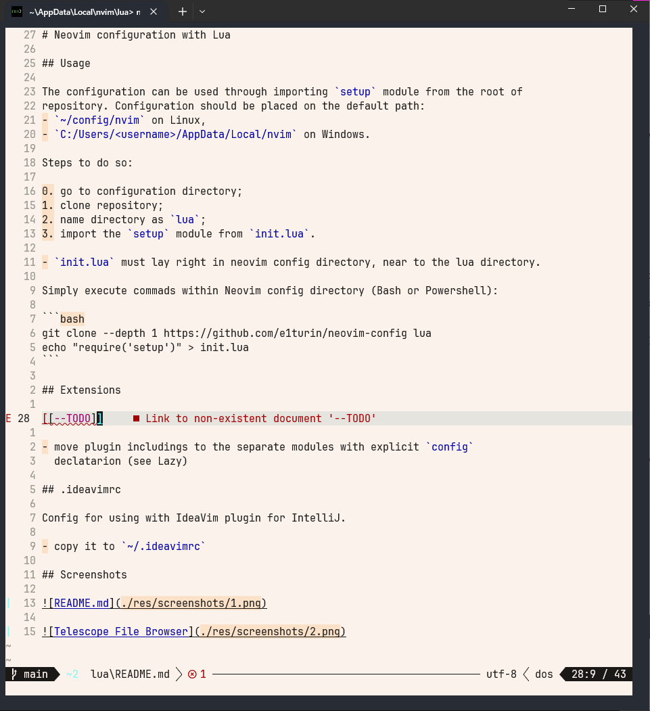
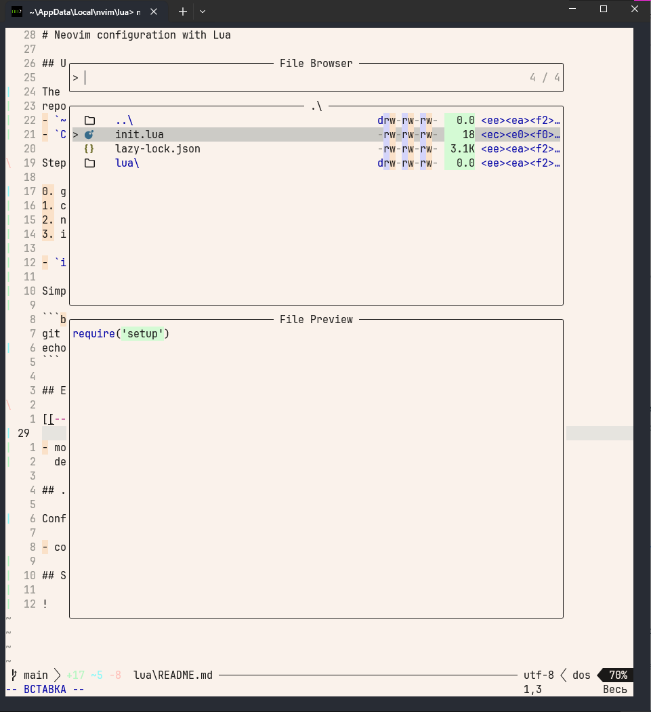

# Neovim configuration with Lua

## Usage

The configuration can be used through importing `setup` module from the root of
repository. Configuration should be placed on the default path: 
- `~/config/nvim` on Linux,
- `C:/Users/<username>/AppData/Local/nvim` on Windows.

Steps to do so:

0. go to configuration directory;
1. clone repository;
2. name directory as `lua`;
3. import the `setup` module from `init.lua`.

- `init.lua` must lay right in neovim config directory, near to the lua directory.

Simply execute commads within Neovim config directory (Bash or Powershell):

```bash
git clone --depth 1 https://github.com/e1turin/neovim-config lua
echo "require('setup')" > init.lua
```

## Extensions

[[--TODO]]

- move plugin includings to the separate modules with explicit `config`
  declatarion (see Lazy)

## .ideavimrc

Config for using with IdeaVim plugin for IntelliJ.

- copy it to `~/.ideavimrc`

## Screenshots




